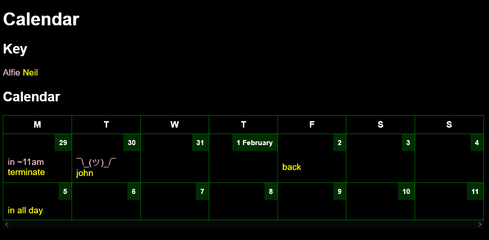

# Calendar

Extremely simple calendar app



## To use

### Edit calendar

Edit the `yaml` calendar file. For example, to set the status for the 5 days beginning `2024-01-29`...

```yaml
2024-01-29:
- monday info
- ¯\_(ツ)_/¯
- tuesday
-
- friday

2024-02-15: doing this on this specific day
```

### Rebuild site

#### With `npm`

```bash
npm run build
```

#### With docker

(for first-time use switch `run build` for `install`)

```bash
docker run --rm --workdir /_site -v $(pwd):/_site --entrypoint "npm" node:18.16.1-alpine3.18 run build
```

or

```bash
./build.sh
```

## Set up on server

### Install nvm and node

Install these in a location accessible to anyone, so that the `www-data` user can use them later.

```bash
# install nvm to /usr/alifeee/nvm
export XDG_CONFIG_HOME="/usr/alifeee"
# install nvm, see https://github.com/nvm-sh/nvm
curl -o- https://raw.githubusercontent.com/nvm-sh/nvm/v0.40.1/install.sh | bash
# install node
source ~/.bashrc
nvm install 20
nvm use 20
```

Now you can use `node` and `npm` as any user by running:

```bash
export NVM_DIR="/usr/alifeee/nvm"
[ -s "$NVM_DIR/nvm.sh" ] && \. "$NVM_DIR/nvm.sh"  # This loads nvm

nvm use 20
npm run build
```

Test this by putting the above in a script and running (e.g.,) `sudo -u www-data build.sh`

### Download files

```bash
mkdir -p /var/www/
git clone git@github.com:alifeee/simple-calendar.git /var/www/simple-calendar/
cd /var/www/simple-calendar/
# add base URL
cp _data/info.json.example _data/info.json
nano _data/info.json
# install and build
npm install
npm run build
chown -R alifeee:www-data _site/
```

### Edit nginx config

```bash
sudo nano /etc/nginx/nginx.conf
```

```nginx
  server {
    server_name cal.alifeee.co.uk;
    location / {
      root /var/www/simple-calendar/_site;
      try_files $uri $uri/ =404;
      add_header Cache-Control no-cache;
      if_modified_since off;
      add_header Last-Modified "";
    }
    location = /edit {
      include fastcgi_params;
      fastcgi_param SCRIPT_FILENAME /var/www/simple-calendar/edit;
      fastcgi_pass unix:/var/run/fcgiwrap.socket;
      auth_basic "calendar edit";
      auth_basic_user_file /etc/nginx/.htpasswd;
    }
    listen 80;
    listen [::]:80;
  }
```

```bash
sudo certbot --nginx
sudo systemctl restart nginx.service
```

### Set up Python for CGI edit script

```bash
python3 -m venv env
./env/bin/pip install -r requirements.txt
chown alifeee:www-data _data/alfie.yaml
```

to test edit script:

```bash
echo 'name=alfie&2024-09-01=what' | sudo -u www-data ./edit
```
